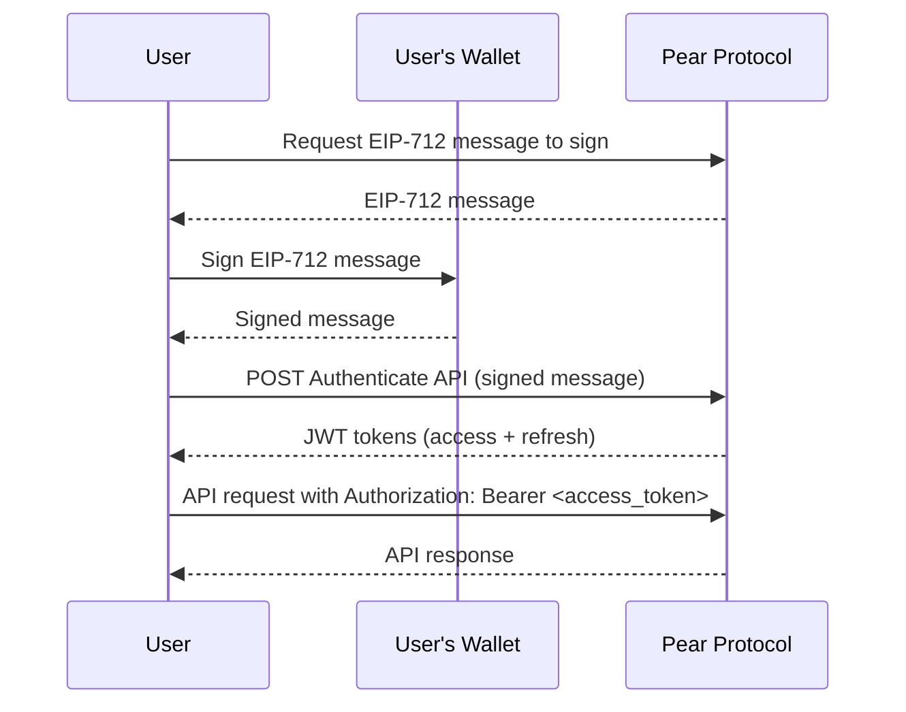
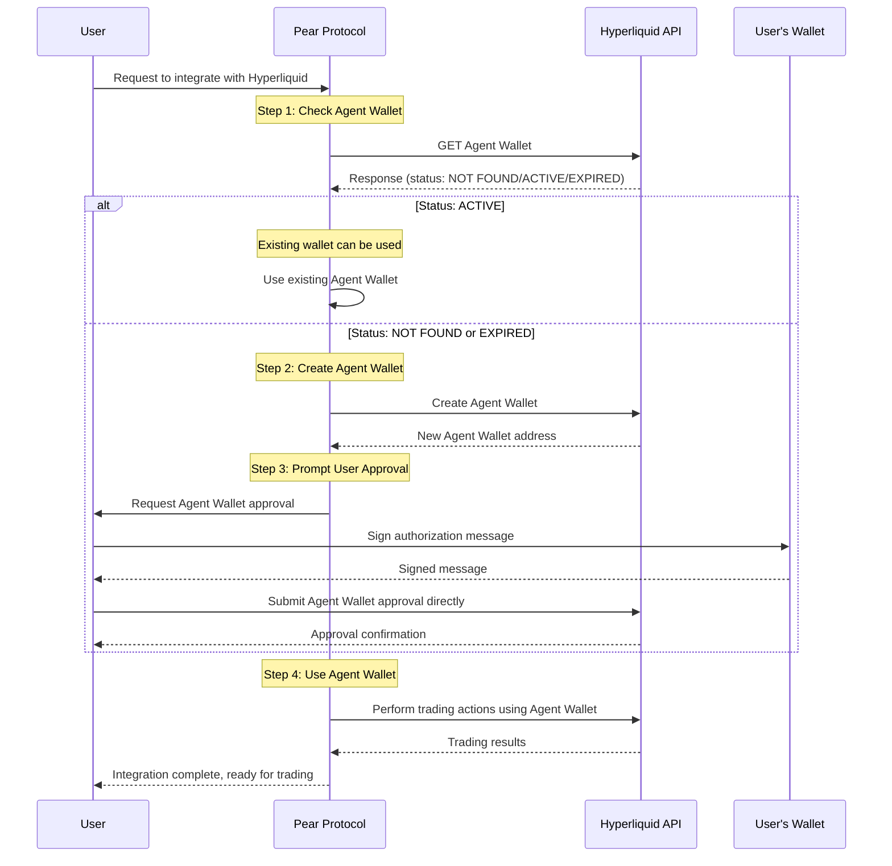

# 🍐 Pear Protocol Integration Guide for TradeTok

> **Complete implementation reference for integrating Pear Protocol's trading backend with TradeTok's social trading platform**

---

## Table of Contents

1. [Overview](#overview)
2. [Authentication Flow](#authentication-flow)
3. [Agent Wallet Setup](#agent-wallet-setup)
4. [Core Trading Concepts](#core-trading-concepts)
5. [Market Data](#market-data)
6. [Order Types & Execution](#order-types--execution)
7. [Position Management](#position-management)
8. [WebSocket Real-Time Updates](#websocket-real-time-updates)
9. [API Reference](#api-reference)
10. [TradeTok Implementation Roadmap](#tradetok-implementation-roadmap)

---

## Overview

### What is Pear Protocol?

**Pear Protocol** is a decentralized trading layer for executing and managing **pair trades** (simultaneous long/short positions) efficiently across DeFi. It connects to top on-chain trading engines like **Hyperliquid** and **SYMM**.

### Key Features

- ✅ **One-click execution** of long/short trades with leverage
- ✅ **Unified dashboard** for charting, analysis, and risk metrics
- ✅ **Advanced order types**: Market, Limit, TWAP, Ladder
- ✅ **TP/SL on ratios** for superior risk management
- ✅ **Basket trading**: Multiple longs + shorts in one transaction

### API Base URL

```
Production (Mainnet): https://hl-v2.pearprotocol.io
```

### Builder Address

All trades are routed through Pear Protocol's builder:

```
0xA47D4d99191db54A4829cdf3de2417E527c3b042
```

**⚠️ Important:** Users must approve this builder address to charge fees before trading.

---

## Authentication Flow

### Overview

Pear uses **EIP-712 wallet signature-based authentication** + **JWT tokens** (no passwords required).

### Authentication Sequence



### Step-by-Step Implementation

#### 1. Get EIP-712 Message

**Endpoint:** `GET /auth/eip712-message`

**Query Parameters:**

- `address` (string, required): User wallet address
- `clientId` (string, required): Client identifier

**Client ID:**

- For individual traders: Use `APITRADER`
- For building products: Contact Pear to obtain your own Client ID

**Example Request:**

```javascript
const response = await fetch(
  `https://hl-v2.pearprotocol.io/auth/eip712-message?address=${userAddress}&clientId=APITRADER`,
);
const { domain, types, primaryType, message, timestamp } =
  await response.json();
```

#### 2. Sign the EIP-712 Message

```javascript
// Using ethers.js
const signature = await signer._signTypedData(domain, types, message);

// Using wagmi/viem
const signature = await signTypedDataAsync({
  domain,
  types,
  primaryType,
  message,
});
```

#### 3. Authenticate with Signature

**Endpoint:** `POST /auth/login`

**Request Body:**

```json
{
  "method": "eip712",
  "address": "0x...",
  "clientId": "APITRADER",
  "details": {
    "signature": "0x...",
    "timestamp": 1234567890
  }
}
```

**Response:**

```json
{
  "accessToken": "eyJ...",
  "refreshToken": "eyJ...",
  "tokenType": "Bearer",
  "expiresIn": 900,
  "address": "0x...",
  "clientId": "APITRADER"
}
```

**Token Lifetimes:**

- Access Token: **15 minutes**
- Refresh Token: **30 days**

#### 4. Use Access Token

Include the access token in all authenticated requests:

```javascript
const headers = {
  Authorization: `Bearer ${accessToken}`,
  "Content-Type": "application/json",
};
```

#### 5. Refresh Token (When Access Token Expires)

**Endpoint:** `POST /auth/refresh`

**Request Body:**

```json
{
  "refreshToken": "eyJ..."
}
```

**Response:**

```json
{
  "accessToken": "eyJ...",
  "refreshToken": "eyJ...",
  "tokenType": "Bearer",
  "expiresIn": 900
}
```

#### 6. Logout

**Endpoint:** `POST /auth/logout`

**Request Body:**

```json
{
  "refreshToken": "eyJ..."
}
```

---

## Agent Wallet Setup

### Overview

Pear uses **Hyperliquid's API/Agent Wallet** system. Each user gets a dedicated **Single Agent Wallet** with its private key securely encrypted within Pear Protocol.

**Agent Wallet Properties:**

- Valid for **180 days**
- Rotated every **30 days**
- One wallet per user

### Agent Wallet Flow



### Implementation Steps

#### 1. Check Agent Wallet Status

**Endpoint:** `GET /agentWallet`

**Response (Wallet Found):**

```json
{
  "agentWalletAddress": "0x..."
}
```

**Response Codes:**

- `200`: Agent wallet exists and is active
- `404`: No agent wallet found (need to create)

#### 2. Create Agent Wallet (If Needed)

**Endpoint:** `POST /agentWallet`

**Response:**

```json
{
  "agentWalletAddress": "0x...",
  "message": "Agent wallet created. Please approve it on Hyperliquid."
}
```

#### 3. User Approves Agent Wallet

The user must sign an authorization message and submit it to Hyperliquid to approve the agent wallet for trading.

**Reference:** [Hyperliquid Agent Wallet Approval](https://hyperliquid.gitbook.io/hyperliquid-docs/for-developers/api/nonces-and-api-wallets#agent-wallet-approval)

---

## Core Trading Concepts

### Price Ratio

For **one long + one short** position, the price ratio is:

$$
\text{Price Ratio} = \frac{\text{Price}_{\text{LONG}}}{\text{Price}_{\text{SHORT}}}
$$

**What it tells you:**

- Ratio **trending up** → Long asset outperforming short
- Ratio **trending down** → Short asset outperforming long

**Use Cases:**

- Captures relative strength between two assets
- Reveals correlation and divergences
- Natural mean-reversion indicator for pair trading

---

### Weighted Price Ratio

For **baskets** (multiple longs + shorts with different weights):

$$
\text{Weighted Ratio} = \prod_{i=1}^{n} \text{Price}_i^{w_i}
$$

**Where:**

- Long positions have **positive weights** (w > 0)
- Short positions have **negative weights** (w < 0)

**Example:**

- 50% Long HYPE, 25% Short ASTER, 25% Short XPL

$$
\text{Weighted Ratio} = \text{HYPE}^{0.5} \cdot \text{ASTER}^{-0.25} \cdot \text{XPL}^{-0.25}
$$

**Interpretation:**

- Weighted ratio **trends up** → Basket performing well
- Weighted ratio **trends down** → Basket underperforming

---

### PnL Calculation

**⚠️ Important:** Pear calculates PnL at the **basket/pair level**, while Hyperliquid UI calculates at the **asset level**. This causes PnL discrepancies until positions are fully closed.

#### Pear PnL Model (Pair-Level)

```
PnL = direction × (exit_price − pair_entry_price) × size − builder_fee − hyperliquid_fee
```

**Where:**

- `direction = +1` for long positions
- `direction = -1` for short positions
- Each basket/pair maintains its **own entry price** for assets

#### Hyperliquid PnL Model (Asset-Level)

Hyperliquid maintains a **global average entry price** across all baskets for the same asset.

#### Example Discrepancy

User opens the same asset in 4 different pairs:

| Pair                | Size   | Entry Price |
| ------------------- | ------ | ----------- |
| ASSET/OTHER-ASSET-A | 149.47 | 33.446      |
| ASSET/OTHER-ASSET-B | 148.79 | 33.613      |
| ASSET/OTHER-ASSET-C | 147.61 | 33.879      |
| ASSET/OTHER-ASSET-D | 146.93 | 34.020      |

**Hyperliquid Global Average:** 33.74

If closing **ASSET/OTHER-ASSET-C** at 34.298:

- **Pear uses:** 33.879 (pair-specific)
- **Hyperliquid uses:** 33.74 (global average)

→ **Different PnL displayed** on each platform

---

## Market Data

### Get Active Assets

**Endpoint:** `GET /markets/active`

Returns actively traded basket/pair markets including:

- Actively traded pairs
- Top 20 pairs with largest ratio changes
- Platform-highlighted pairs

**Response Structure:**

```json
{
  "active": [...],
  "topGainers": [...],
  "topLosers": [...],
  "highlighted": [...],
  "watchlist": [...]
}
```

**⚠️ Note:** Volume and open interest data only reflects actively traded pairs, not full liquidity.

### Get Markets Data (with Filtering)

**Endpoint:** `GET /markets`

**Query Parameters:**

- `offset` (string): Pagination offset
- `page` (string): Page number
- `pageSize` (string): Items per page
- `engine` (string): Filter by engine type
- `minVolume` (string): Minimum volume filter
- `change24h` (string): Price change filter
- `netFunding` (string): Positive/negative funding rate filter
- `searchText` (string): Search filter
- `sort` (string): Sort field and direction (e.g., `volume:desc`)
- `excludeText` (string): Text to exclude
- `active` (string): Active status filter

**Response:**

```json
{
  "markets": [
    {
      "longAssets": [{ "asset": "SOL", "weight": 0.5 }],
      "shortAssets": [{ "asset": "ETH", "weight": 0.5 }],
      "openInterest": "1250000",
      "volume": "3400000",
      "ratio": "0.0234",
      "prevRatio": "0.0228",
      "change24h": "0.0263",
      "weightedRatio": "0.0235",
      "weightedPrevRatio": "0.0229",
      "weightedChange24h": "0.0262",
      "netFunding": "-0.0001"
    }
  ],
  "total": 150,
  "page": 1,
  "pageSize": 20,
  "totalPages": 8
}
```

---

## Order Types & Execution

### 1. Market Order

Executes immediately at current market ratios with **8% default slippage**.

**Endpoint:** `POST /positions`

**Request Body:**

```json
{
  "executionType": "MARKET",
  "leverage": 5,
  "usdValue": 1000,
  "slippage": 0.08,
  "longAssets": [{ "asset": "SOL", "weight": 0.5 }],
  "shortAssets": [{ "asset": "ETH", "weight": 0.5 }],
  "stopLoss": {
    "type": "PERCENTAGE",
    "value": 10
  },
  "takeProfit": {
    "type": "PERCENTAGE",
    "value": 20
  }
}
```

**Response:**

```json
{
  "orderId": "uuid-here",
  "fills": [...]
}
```

---

### 2. Limit Order

Executes only when the pair ratio reaches a specified target level. **Off-chain, updates every second.**

**Endpoint:** `POST /positions`

**Request Body:**

```json
{
  "executionType": "TRIGGER",
  "leverage": 3,
  "usdValue": 500,
  "slippage": 0.08,
  "longAssets": [{ "asset": "BTC", "weight": 1 }],
  "shortAssets": [{ "asset": "ETH", "weight": 1 }],
  "triggerType": "PRICE_RATIO",
  "triggerValue": "15.5",
  "direction": "LESS_THAN"
}
```

**Trigger Types:**

- `PRICE`: Single asset price
- `PRICE_RATIO`: Ratio between two assets
- `WEIGHTED_RATIO`: Weighted basket ratio
- `BTC_DOM`: Bitcoin dominance
- `CROSS_ASSET_PRICE`: Cross-asset price monitoring
- `PREDICTION_MARKET_OUTCOME`: Prediction market trigger

**Direction:**

- `MORE_THAN`: Execute when value rises above trigger
- `LESS_THAN`: Execute when value falls below trigger

---

### 3. TWAP (Time-Weighted Average Price)

Breaks large orders into smaller chunks over time to minimize market impact. **Shielded execution** (CEX-style, not exposed on-chain).

**Endpoint:** `POST /positions`

**Request Body:**

```json
{
  "executionType": "TWAP",
  "leverage": 2,
  "usdValue": 5000,
  "slippage": 0.08,
  "longAssets": [{ "asset": "AVAX", "weight": 1 }],
  "shortAssets": [{ "asset": "LINK", "weight": 1 }],
  "twapDuration": 60,
  "twapIntervalSeconds": 30,
  "randomizeExecution": true
}
```

**TWAP Parameters:**

- `twapDuration` (number, required): Total duration in minutes
- `twapIntervalSeconds` (number, optional): Time between chunks (default: 30s)
- `randomizeExecution` (boolean, optional): Randomize chunk timing (default: false)

**Minimum chunk size:** $11 per asset

---

### 4. Ladder Order

Creates multiple orders at different ratio levels.

**Endpoint:** `POST /positions`

**Request Body:**

```json
{
  "executionType": "LADDER",
  "leverage": 5,
  "usdValue": 2000,
  "slippage": 0.08,
  "longAssets": [{ "asset": "SOL", "weight": 1 }],
  "shortAssets": [{ "asset": "ETH", "weight": 1 }],
  "ladderConfig": {
    "ratioStart": 0.02,
    "ratioEnd": 0.025,
    "numberOfLevels": 5
  }
}
```

---

### 5. Basket Trade

Execute multiple longs + shorts simultaneously in one transaction.

**Example:** Long BTC + ETH, Short DOGE + SHIB

**Request Body:**

```json
{
  "executionType": "MARKET",
  "leverage": 3,
  "usdValue": 1500,
  "slippage": 0.08,
  "longAssets": [
    { "asset": "BTC", "weight": 0.5 },
    { "asset": "ETH", "weight": 0.5 }
  ],
  "shortAssets": [
    { "asset": "DOGE", "weight": 0.5 },
    { "asset": "SHIB", "weight": 0.5 }
  ]
}
```

**Weight Notes:**

- Weights must be between 0.0001 and 1.0
- If not provided, weights are evenly distributed
- Long and short weights are calculated independently

---

## Position Management

### Get Open Positions

**Endpoint:** `GET /positions`

**Response:**

```json
[
  {
    "positionId": "uuid",
    "address": "0x...",
    "pearExecutionFlag": "PEAR",
    "stopLoss": {
      "type": "PERCENTAGE",
      "value": 10
    },
    "takeProfit": {
      "type": "PERCENTAGE",
      "value": 20
    },
    "entryRatio": 0.0234,
    "markRatio": 0.0241,
    "entryPositionValue": 1000,
    "positionValue": 1045,
    "marginUsed": 200,
    "unrealizedPnl": 45,
    "unrealizedPnlPercentage": 22.5,
    "longAssets": [
      {
        "coin": "SOL",
        "entryPrice": 98.45,
        "actualSize": 5.08,
        "leverage": 5,
        "marginUsed": 100,
        "positionValue": 520,
        "unrealizedPnl": 20,
        "entryPositionValue": 500,
        "initialWeight": 0.5,
        "fundingPaid": -2.5
      }
    ],
    "shortAssets": [
      {
        "coin": "ETH",
        "entryPrice": 2100,
        "actualSize": -0.238,
        "leverage": 5,
        "marginUsed": 100,
        "positionValue": 525,
        "unrealizedPnl": 25,
        "entryPositionValue": 500,
        "initialWeight": 0.5,
        "fundingPaid": 1.2
      }
    ],
    "createdAt": "2026-01-16T10:30:00Z",
    "updatedAt": "2026-01-16T22:15:00Z"
  }
]
```

---

### Close Position

**Endpoint:** `POST /positions/{positionId}/close`

**Request Body (Market Close):**

```json
{
  "executionType": "MARKET"
}
```

**Request Body (TWAP Close):**

```json
{
  "executionType": "TWAP",
  "twapDuration": 30,
  "twapIntervalSeconds": 30,
  "randomizeExecution": true
}
```

**Response:**

```json
{
  "orderId": "uuid",
  "executionTime": "2026-01-16T22:18:00Z",
  "chunksScheduled": 60
}
```

---

### Close All Positions

**Endpoint:** `POST /positions/close-all`

**Request Body:**

```json
{
  "executionType": "MARKET"
}
```

**Response:**

```json
{
  "results": [
    {
      "positionId": "uuid-1",
      "success": true,
      "orderId": "order-uuid-1"
    },
    {
      "positionId": "uuid-2",
      "success": true,
      "orderId": "order-uuid-2"
    },
    {
      "positionId": "uuid-3",
      "success": false,
      "error": "Insufficient margin"
    }
  ]
}
```

---

### Adjust Position Size

**Endpoint:** `POST /positions/{positionId}/adjust`

**Request Body (Reduce 50%):**

```json
{
  "adjustmentType": "REDUCE",
  "adjustmentSize": 50,
  "executionType": "MARKET"
}
```

**Request Body (Increase 25% with Limit):**

```json
{
  "adjustmentType": "INCREASE",
  "adjustmentSize": 25,
  "executionType": "LIMIT",
  "limitRatio": 0.024
}
```

**Response:**

```json
{
  "orderId": "uuid",
  "status": "EXECUTED",
  "adjustmentType": "REDUCE",
  "adjustmentSize": 50,
  "newSize": 500,
  "executedAt": "2026-01-16T22:18:00Z"
}
```

---

### Update Take Profit / Stop Loss

**Endpoint:** `PUT /positions/{positionId}/riskParameters`

**TP/SL Types:**

1. **PERCENTAGE**: % change vs entry price
2. **DOLLAR**: Fixed USD profit/loss
3. **POSITION_VALUE**: % change of position value
4. **PRICE**: Absolute price level
5. **PRICE_RATIO**: Price ratio level
6. **WEIGHTED_RATIO**: Weighted ratio level

**Request Body:**

```json
{
  "stopLoss": {
    "type": "PERCENTAGE",
    "value": 15,
    "isTrailing": true,
    "trailingDeltaValue": 5,
    "trailingActivationValue": 10
  },
  "takeProfit": {
    "type": "DOLLAR",
    "value": 200
  }
}
```

**Remove TP/SL:**

```json
{
  "stopLoss": null,
  "takeProfit": null
}
```

**Response:**

```json
{
  "positionId": "uuid",
  "stopLoss": { ... },
  "takeProfit": { ... },
  "updatedAt": "2026-01-16T22:18:00Z"
}
```

---

### Adjust Leverage

**Endpoint:** `POST /positions/{positionId}/adjust-leverage`

**Request Body:**

```json
{
  "leverage": 10
}
```

**Leverage Range:** 1–100x

---

## WebSocket Real-Time Updates

**WebSocket URL:** `wss://hl-v2.pearprotocol.io/ws`

### Available Channels

1. `open-orders` – Real-time order updates
2. `trade-histories` – Trade execution updates
3. `positions` – Position changes
4. `twap-details` – TWAP chunk execution status
5. `notifications` – System notifications
6. `account-summary` – Account balance updates
7. `market-data` – Market price/ratio updates

### Subscribe to Channels

```javascript
const ws = new WebSocket("wss://hl-v2.pearprotocol.io/ws");

ws.onopen = () => {
  ws.send(
    JSON.stringify({
      action: "subscribe",
      address: "0xYourEthereumAddressHere",
      channels: ["open-orders", "positions", "market-data"],
    }),
  );
};

ws.onmessage = (event) => {
  const data = JSON.parse(event.data);
  console.log("WebSocket update:", data);

  // Handle different channel updates
  if (data.channel === "positions") {
    // Update position UI
  } else if (data.channel === "market-data") {
    // Update market prices/ratios
  }
};
```

**⚠️ Note:** Currently only **one address subscription per WebSocket connection**.

---

## API Reference

### Authentication

| Endpoint               | Method | Description                 |
| ---------------------- | ------ | --------------------------- |
| `/auth/eip712-message` | GET    | Get EIP-712 message to sign |
| `/auth/login`          | POST   | Authenticate with signature |
| `/auth/refresh`        | POST   | Refresh access token        |
| `/auth/logout`         | POST   | Invalidate refresh token    |

### Agent Wallet

| Endpoint       | Method | Description             |
| -------------- | ------ | ----------------------- |
| `/agentWallet` | GET    | Get agent wallet status |
| `/agentWallet` | POST   | Create new agent wallet |

### Positions

| Endpoint                          | Method | Description               |
| --------------------------------- | ------ | ------------------------- |
| `/positions`                      | GET    | List open positions       |
| `/positions`                      | POST   | Create new position/order |
| `/positions/{id}/close`           | POST   | Close entire position     |
| `/positions/close-all`            | POST   | Close all positions       |
| `/positions/{id}/adjust`          | POST   | Adjust position size      |
| `/positions/{id}/adjust-leverage` | POST   | Adjust leverage           |
| `/positions/{id}/riskParameters`  | PUT    | Update TP/SL              |

### Orders

| Endpoint                   | Method | Description                     |
| -------------------------- | ------ | ------------------------------- |
| `/orders/open`             | GET    | Get all open orders             |
| `/orders/twap`             | GET    | Get TWAP orders with monitoring |
| `/orders/{id}/cancel`      | DELETE | Cancel pending order            |
| `/orders/{id}/twap/cancel` | POST   | Cancel TWAP order               |
| `/orders/spot`             | POST   | Execute spot order              |

### Markets

| Endpoint          | Method | Description              |
| ----------------- | ------ | ------------------------ |
| `/markets`        | GET    | Get markets with filters |
| `/markets/active` | GET    | Get active markets       |

### Trade History

| Endpoint         | Method | Description       |
| ---------------- | ------ | ----------------- |
| `/trade-history` | GET    | Get trade history |

### Account

| Endpoint     | Method | Description           |
| ------------ | ------ | --------------------- |
| `/accounts`  | GET    | Get account summary   |
| `/portfolio` | GET    | Get portfolio metrics |

### Notifications

| Endpoint              | Method | Description       |
| --------------------- | ------ | ----------------- |
| `/notifications`      | GET    | Get notifications |
| `/notifications/read` | POST   | Mark as read      |

### Watchlist

| Endpoint     | Method | Description                |
| ------------ | ------ | -------------------------- |
| `/watchlist` | POST   | Toggle basket in watchlist |

---

## TradeTok Implementation Roadmap

### Phase 1: Core Authentication & Wallet Setup

**Goal:** Enable users to connect wallet and set up trading

**Tasks:**

1. ✅ **Implement EIP-712 Authentication**
   - Add wallet connection (RainbowKit/Wagmi)
   - Fetch EIP-712 message from Pear
   - Sign message with user wallet
   - Store JWT tokens securely (localStorage/sessionStorage)
   - Implement token refresh logic

2. ✅ **Agent Wallet Setup Flow**
   - Check if user has agent wallet
   - Create agent wallet if needed
   - Prompt user to approve agent wallet on Hyperliquid
   - Display approval instructions/tutorial

3. ✅ **Builder Fee Approval**
   - Check if user has approved builder address
   - Prompt approval transaction
   - Monitor approval status

**UI Components Needed:**

- `<WalletConnectButton />` – Connect/disconnect wallet
- `<AgentWalletSetupModal />` – Guide through agent wallet creation
- `<BuilderApprovalModal />` – Request builder fee approval

---

### Phase 2: Feed Integration (View Trades)

**Goal:** Display real trades from Pear Protocol in TikTok-style feed

**Tasks:**

1. ✅ **Fetch Active Markets**
   - Call `GET /markets/active` for trending pairs
   - Display top gainers/losers
   - Show highlighted pairs

2. ✅ **Fetch Open Positions (Global)**
   - Aggregate positions from multiple traders
   - Filter by criteria (risk level, PnL, asset pairs)
   - Sort by engagement metrics

3. ✅ **Display Trade Post**
   - Show trader info (username, verified badge, followers)
   - Display pair (e.g., SOL/ETH)
   - Show entry price, current price, PnL
   - Voice note player (simulated for now)
   - Like, comment, share buttons
   - **Copy Trade** CTA button

**UI Components:**

- `<TradeFeed />` – Vertical scrolling feed
- `<TradePostCard />` – Individual trade display
- `<VoiceNotePlayer />` – Play/pause voice thesis

---

### Phase 3: Copy Trading Execution

**Goal:** Enable one-tap copy trading from feed

**Tasks:**

1. ✅ **Copy Trade Modal**
   - Select investment amount ($100, $500, $1000, custom)
   - Risk adjustment slider (match exactly or reduce risk)
   - Set custom TP/SL
   - Show estimated fees
   - Confirm and execute

2. ✅ **Execute Copy Trade**
   - Call `POST /positions` with same long/short assets
   - Apply user's custom risk parameters
   - Show execution progress
   - Display success/error feedback

3. ✅ **Position Tracking**
   - Fetch user's open positions
   - Display in Portfolio screen
   - Real-time P&L updates via WebSocket

**UI Components:**

- `<CopyTradeModal />` – Copy trade configuration
- `<PositionCard />` – Display open position
- `<PortfolioOverview />` – Portfolio summary

---

### Phase 4: Voice Integration

**Goal:** Enable voice commands for hands-free trading

**Tasks:**

1. ✅ **Voice Command Parser**
   - "Copy this with $500" → Parse amount, execute
   - "Show me low risk trades" → Filter feed
   - "What's my portfolio?" → Navigate to portfolio
   - "Find SOL trades" → Search by asset

2. ✅ **Voice Recording for Creators**
   - Record voice thesis when opening trade
   - Upload to storage (IPFS/S3)
   - Attach voice URL to trade metadata

3. ✅ **Voice Playback**
   - Stream voice notes in feed
   - Waveform visualization
   - Play/pause controls

**UI Components:**

- `<VoiceOverlay />` – Voice command interface
- `<VoiceRecorder />` – Record voice thesis
- `<VoiceWaveform />` – Visual waveform display

---

### Phase 4.5: Chat/Prompt Interface

**Goal:** Enable text-based conversational trading as an alternative to voice commands

**Overview:**

Instead of (or in addition to) voice, users can type natural language commands into a chat interface to interact with TradeTok. This provides a **ChatGPT-like experience** for trading, portfolio management, and market discovery.

**Why Chat/Prompt?**

✅ **More accurate** than voice (no transcription errors)  
✅ **Works anywhere** (public spaces, quiet environments)  
✅ **Reviewable** (scroll back through conversation history)  
✅ **Accessible** (works for hearing-impaired users)  
✅ **Copy/paste** friendly (share commands with others)

---

#### **Architecture Overview**

```
User types message
       ↓
Parse intent (LLM or Rules)
       ↓
Extract structured data
       ↓
Validate parameters
       ↓
Execute action (Pear API / UI navigation)
       ↓
Show response + confirmation
```

---

#### **Tasks:**

##### 1. ✅ **Chat UI Component**

Build a conversational interface with:

- **Command bar** at bottom of screen (like messaging apps)
- **Message history** showing user inputs and AI responses
- **Typing indicator** while processing
- **Rich responses** (text, cards, charts, confirmations)
- **Quick actions** (suggested commands as chips)

**Interface Types:**

- **Type A: Command Bar** – Single input, quick actions (best for TradeTok)
- **Type B: Full Chat Thread** – Conversational history, context retention
- **Type C: Hybrid** – Command bar that expands to full chat

##### 2. ✅ **Intent Parsing System**

Choose one of three approaches:

**Option A: Rule-Based Parser** (Fast, Free, Limited)

- Use regex patterns to match commands
- Example: `"copy this with $500"` → Extract `action: copy`, `amount: 500`
- **Pros:** Fast, no API costs, works offline
- **Cons:** Limited flexibility, needs many patterns

**Option B: LLM-Based Parser** (Smart, Flexible, Recommended)

- Send user message to GPT-4/Claude
- Ask LLM to return structured JSON intent
- **Pros:** Understands natural variations, context-aware
- **Cons:** API costs (~$0.01 per command), slight latency

**Option C: Hybrid** (Best of Both)

- Use rules for common commands (fast path)
- Fall back to LLM for complex queries
- **Pros:** Fast + flexible
- **Cons:** More complex to build

##### 3. ✅ **LLM Integration**

**How it works:**

1. User types: `"Copy this SOL/ETH trade with $1000 and set stop loss at 10%"`

2. Send to LLM with context:

```
You are a trading assistant for TradeTok. Parse the user's command and return structured JSON.

Available actions:
- copy_trade: Copy a trade with specified amount and risk params
- search_trades: Filter/search for trades
- view_portfolio: Show portfolio stats
- close_position: Close a specific position
- adjust_position: Modify existing position

User command: "Copy this SOL/ETH trade with $1000 and set stop loss at 10%"

Current context:
- User is viewing a SOL/ETH trade (positionId: abc-123)
- User has $5000 available balance

Return JSON only:
{
  "action": "...",
  "params": {...}
}
```

3. LLM returns:

```json
{
  "action": "copy_trade",
  "params": {
    "positionId": "abc-123",
    "amount": 1000,
    "stopLoss": {
      "type": "PERCENTAGE",
      "value": 10
    }
  }
}
```

4. Execute action via Pear API

##### 4. ✅ **Context Management**

The chat needs to know **where the user is** in the app:

**Context Examples:**

- **On Feed (viewing trade):** "Copy this" → Knows which trade
- **On Portfolio:** "Close this" → Knows which position
- **On Discover:** "Show more like this" → Uses current filters

**Context Data Structure:**

```typescript
interface ChatContext {
  currentScreen: "feed" | "portfolio" | "discover" | "profile";
  selectedTrade?: Trade;
  selectedPosition?: Position;
  currentFilters?: {
    asset?: string;
    riskLevel?: "low" | "medium" | "high";
  };
  userBalance: number;
}
```

##### 5. ✅ **Command Categories**

**Trade Discovery:**

- "Show me trending pairs"
- "Find trades by @cryptojake"
- "What are the top gainers today?"
- "Show me low risk SOL trades"

**Copy Trading:**

- "Copy this with $500"
- "Copy this but reduce risk by 50%"
- "Copy this trade and set take profit at 20%"

**Portfolio Management:**

- "What's my total P&L?"
- "Show my open positions"
- "Close all losing trades"
- "How much am I down on ETH?"

**Position Actions:**

- "Close my SOL/ETH position"
- "Increase my BTC position by 25%"
- "Set stop loss on all positions at 15%"
- "What's my biggest winner?"

**Market Analysis:**

- "Why is SOL/ETH ratio going up?"
- "Explain this trade to me"
- "What's the risk level here?"
- "Should I take profit now?"

**Learning & Help:**

- "How do TWAP orders work?"
- "What's a good stop loss percentage?"
- "Explain weighted ratios"

##### 6. ✅ **Response Types**

**Text Only:**

```
User: "What's my win rate?"
AI: "Your win rate is 68% with 45 winning trades and 23 losing trades."
```

**Text + UI Action:**

```
User: "Show me low risk trades"
AI: "Found 12 low-risk trades. Filtering feed now..."
[App navigates to filtered feed]
```

**Text + Confirmation:**

```
User: "Close my SOL position"
AI: "Are you sure you want to close your SOL/ETH position?
     Current P&L: +$234 (+12.3%)
     [Confirm] [Cancel]"
```

**Rich Response (Cards/Charts):**

```
User: "How's my portfolio doing?"
AI: [Shows portfolio card with chart, stats, breakdown]
```

##### 7. ✅ **Safety & Validation**

**High-Risk Commands Need Confirmation:**

- Closing positions
- Large copy trades (>$1000)
- Adjusting leverage
- Closing all positions

**Example Flow:**

```
User: "Close all my positions"
       ↓
AI: "⚠️ This will close 5 positions worth $12,450.
     Estimated P&L: +$1,234. Confirm?"
       ↓
User: "Yes" or clicks [Confirm]
       ↓
Execute action
```

##### 8. ✅ **Suggested Commands**

Show contextual quick-action chips:

**On Feed:**

- "Copy this with $500"
- "Show me more like this"
- "Who is this trader?"

**On Portfolio:**

- "What's my P&L?"
- "Close losing positions"
- "Show best trade"

**On Discover:**

- "Show trending pairs"
- "Filter by low risk"
- "Find SOL trades"

---

#### **UI Components:**

- `<ChatInterface />` – Main chat container
- `<ChatInput />` – Message input field
- `<ChatMessage />` – Individual message bubble
- `<ChatResponse />` – AI response with actions
- `<QuickActions />` – Suggested command chips
- `<ConfirmationDialog />` – For risky actions

---

#### **Technical Stack:**

| Component           | Technology                       | Cost           |
| ------------------- | -------------------------------- | -------------- |
| **LLM API**         | OpenAI GPT-4 or Anthropic Claude | ~$0.01/command |
| **Intent Parsing**  | LLM + structured output          | Included above |
| **Context Storage** | React Context / Zustand          | Free           |
| **Message History** | Local state or database          | Free/minimal   |

---

#### **Cost Optimization:**

1. **Cache common responses** – Store frequent queries
2. **Use cheaper models** for simple commands (GPT-3.5)
3. **Batch multiple intents** in one LLM call
4. **Rule-based fast path** for common patterns

**Estimated costs:**

- 1000 commands/month = ~$10
- 10,000 commands/month = ~$100

---

#### **Example User Journey:**

```
1. User opens TradeTok feed
2. Sees interesting SOL/ETH trade
3. Types: "Tell me about this trade"
4. AI: "This is a long SOL / short ETH pair trade by @cryptojake.
       Entry ratio: 0.0234, Current P&L: +3.2%, Risk: Medium"
5. User: "Copy with $500 and 5% stop loss"
6. AI: "Opening copy trade modal with $500 and 5% SL..."
7. [Modal opens, pre-filled]
8. User confirms
9. Trade executes via Pear Protocol
10. AI: "✅ Trade copied! Position opened with $500."
```

---

#### **Integration with Voice:**

**Hybrid Approach (Recommended):**

1. **Voice button** converts speech to text (Whisper API)
2. **Transcription appears** in chat input
3. **User can edit** before sending
4. **Same backend** processes both voice and text

This gives users:

- **Convenience** of voice
- **Accuracy** of text
- **Flexibility** to choose

---

#### **Prompt Engineering Template:**

```
You are TradeTok AI, a trading assistant that helps users discover, copy, and manage pair trades.

Context:
- Current screen: {screen}
- Viewing trade: {tradeId} ({pair})
- User balance: ${balance}
- Open positions: {positionCount}

Available actions:
1. copy_trade - Copy a trade with amount and risk params
2. search_trades - Filter trades by criteria
3. view_portfolio - Show portfolio stats
4. close_position - Close specific position
5. adjust_position - Modify position size/leverage
6. set_risk_params - Update TP/SL
7. navigate - Navigate to different screen
8. explain - Explain trading concepts

User message: "{userMessage}"

Return JSON with this structure:
{
  "action": "action_name",
  "params": { ... },
  "requiresConfirmation": boolean,
  "response": "friendly message to user"
}

Rules:
- Always validate amounts against user balance
- Require confirmation for risky actions (close, large trades)
- Be concise but friendly
- Use emojis sparingly
```

---

**UI Components:**

- `<ChatInterface />` – Main chat container
- `<ChatInput />` – Message input with send button
- `<MessageBubble />` – User/AI message display
- `<QuickActionChips />` – Suggested commands
- `<ConfirmationCard />` – For risky actions

---

### Phase 5: Social Features

**Goal:** Add social engagement layer

**Tasks:**

1. ✅ **Follow/Unfollow Traders**
   - Follow button on trader profiles
   - Followers count
   - Following feed filter

2. ✅ **Comments & Likes**
   - Like trades (heart icon)
   - Comment on trades
   - Real-time comment threads

3. ✅ **Share Trades**
   - Share to Twitter/X
   - Share link with deep linking
   - Referral tracking

4. ✅ **Trader Profiles**
   - Total P&L
   - Win rate
   - Average return
   - Trade history
   - Followers/following count

**UI Components:**

- `<TraderProfile />` – Trader detail page
- `<CommentThread />` – Comments section
- `<ShareModal />` – Share options

---

### Phase 6: Advanced Order Types

**Goal:** Support Limit, TWAP, Ladder orders

**Tasks:**

1. ✅ **Limit Orders**
   - Set target price ratio
   - Choose direction (MORE_THAN/LESS_THAN)
   - Display in Open Orders tab

2. ✅ **TWAP Orders**
   - Configure TWAP duration
   - Set chunk interval
   - Randomize execution toggle
   - Monitor TWAP chunks via `GET /orders/twap`

3. ✅ **Ladder Orders**
   - Define ratio start/end
   - Set number of levels
   - Preview order distribution

**UI Components:**

- `<LimitOrderModal />` – Set limit price
- `<TWAPConfigModal />` – TWAP settings
- `<LadderOrderModal />` – Ladder configuration

---

### Phase 7: Real-Time Updates (WebSocket)

**Goal:** Live position & market updates

**Tasks:**

1. ✅ **WebSocket Connection Manager**
   - Connect on app load
   - Subscribe to user's channels
   - Reconnect on disconnect
   - Handle auth token in WebSocket

2. ✅ **Real-Time Position Updates**
   - Update P&L live
   - Show TP/SL triggers
   - Flash animation on updates

3. ✅ **Real-Time Market Data**
   - Update ratios in feed
   - Refresh top gainers/losers
   - Price ticker animations

**Implementation:**

```javascript
// hooks/useWebSocket.ts
const useWebSocket = (userAddress: string) => {
  const [positions, setPositions] = useState([]);
  const ws = useRef<WebSocket | null>(null);

  useEffect(() => {
    ws.current = new WebSocket('wss://hl-v2.pearprotocol.io/ws');

    ws.current.onopen = () => {
      ws.current?.send(JSON.stringify({
        action: 'subscribe',
        address: userAddress,
        channels: ['positions', 'market-data', 'notifications']
      }));
    };

    ws.current.onmessage = (event) => {
      const data = JSON.parse(event.data);

      if (data.channel === 'positions') {
        setPositions(data.positions);
      }
    };

    return () => ws.current?.close();
  }, [userAddress]);

  return { positions };
};
```

---

### Phase 8: Portfolio Analytics

**Goal:** Advanced portfolio insights

**Tasks:**

1. ✅ **Portfolio Dashboard**
   - Total value chart (1D, 1W, 1M, 1Y, All)
   - Win/loss breakdown
   - Volume over time
   - Open interest tracking

2. ✅ **Performance Metrics**
   - Sharpe ratio
   - Max drawdown
   - Best/worst trades
   - Asset allocation breakdown

**Endpoint:** `GET /portfolio`

**Response Structure:**

```json
{
  "intervals": {
    "oneDay": [...],
    "oneWeek": [...],
    "oneMonth": [...],
    "oneYear": [...],
    "all": [...]
  },
  "overall": {
    "totalWinningTradesCount": 45,
    "totalLosingTradesCount": 23,
    "totalWinningUsd": 12450,
    "totalLosingUsd": 3200,
    "currentOpenInterest": 8500,
    "currentTotalVolume": 125000,
    "unrealizedPnl": 1234,
    "totalTrades": 68
  }
}
```

---

### Phase 9: Creator Tools

**Goal:** Enable creators to post trades directly

**Tasks:**

1. ✅ **Create Trade Post**
   - Open position via Pear API
   - Attach voice thesis
   - Add text description
   - Set visibility (public/followers)

2. ✅ **Trade Post Analytics**
   - Views count
   - Copies count
   - Engagement metrics
   - Revenue from copies (if tiered pricing)

3. ✅ **Creator Dashboard**
   - Total followers
   - Total copies
   - Average copy performance
   - Earnings overview

---

### Phase 10: Notifications & Alerts

**Goal:** Keep users informed of important events

**Tasks:**

1. ✅ **System Notifications**
   - Order executed
   - TP/SL triggered
   - Position liquidation warning
   - New follower
   - Trade copied

2. ✅ **Notification Center**
   - Display `GET /notifications`
   - Mark as read `POST /notifications/read`
   - Filter by type

3. ✅ **Push Notifications** (Optional)
   - Browser push notifications
   - Mobile push (if native app)

---

## Implementation Best Practices

### 1. Error Handling

```javascript
async function executeTrade(tradeData) {
  try {
    const response = await fetch("https://hl-v2.pearprotocol.io/positions", {
      method: "POST",
      headers: {
        Authorization: `Bearer ${accessToken}`,
        "Content-Type": "application/json",
      },
      body: JSON.stringify(tradeData),
    });

    if (!response.ok) {
      const error = await response.json();
      throw new Error(error.message || "Trade execution failed");
    }

    return await response.json();
  } catch (error) {
    console.error("Trade execution error:", error);
    toast.error(error.message);
    throw error;
  }
}
```

### 2. Token Management

```javascript
// utils/auth.ts
export const getAccessToken = () => localStorage.getItem('pear_access_token');
export const getRefreshToken = () => localStorage.getItem('pear_refresh_token');

export const setTokens = (accessToken: string, refreshToken: string) => {
  localStorage.setItem('pear_access_token', accessToken);
  localStorage.setItem('pear_refresh_token', refreshToken);
};

export const clearTokens = () => {
  localStorage.removeItem('pear_access_token');
  localStorage.removeItem('pear_refresh_token');
};

export const refreshAccessToken = async () => {
  const refreshToken = getRefreshToken();
  if (!refreshToken) throw new Error('No refresh token');

  const response = await fetch('https://hl-v2.pearprotocol.io/auth/refresh', {
    method: 'POST',
    headers: { 'Content-Type': 'application/json' },
    body: JSON.stringify({ refreshToken })
  });

  const { accessToken, refreshToken: newRefreshToken } = await response.json();
  setTokens(accessToken, newRefreshToken);

  return accessToken;
};
```

### 3. API Client with Auto-Refresh

```javascript
// lib/pearClient.ts
class PearClient {
  private baseURL = 'https://hl-v2.pearprotocol.io';

  async request(endpoint: string, options: RequestInit = {}) {
    let accessToken = getAccessToken();

    const response = await fetch(`${this.baseURL}${endpoint}`, {
      ...options,
      headers: {
        'Authorization': `Bearer ${accessToken}`,
        'Content-Type': 'application/json',
        ...options.headers
      }
    });

    // Auto-refresh on 401
    if (response.status === 401) {
      accessToken = await refreshAccessToken();

      return fetch(`${this.baseURL}${endpoint}`, {
        ...options,
        headers: {
          'Authorization': `Bearer ${accessToken}`,
          'Content-Type': 'application/json',
          ...options.headers
        }
      });
    }

    return response;
  }

  async getOpenPositions() {
    const response = await this.request('/positions');
    return response.json();
  }

  async createPosition(data: CreatePositionRequest) {
    const response = await this.request('/positions', {
      method: 'POST',
      body: JSON.stringify(data)
    });
    return response.json();
  }
}

export const pearClient = new PearClient();
```

### 4. Type Definitions

```typescript
// types/pear.ts
export type ExecutionType = "MARKET" | "TRIGGER" | "TWAP" | "LADDER";
export type TriggerType =
  | "PRICE"
  | "PRICE_RATIO"
  | "WEIGHTED_RATIO"
  | "BTC_DOM";
export type Direction = "LONG" | "SHORT";

export interface PairAsset {
  asset: string;
  weight?: number; // 0.0001 to 1.0
}

export interface CreatePositionRequest {
  executionType: ExecutionType;
  leverage: number; // 1-100
  usdValue: number;
  slippage: number; // 0.001-0.1
  longAssets: PairAsset[];
  shortAssets: PairAsset[];
  stopLoss?: TPSLThreshold;
  takeProfit?: TPSLThreshold;
  triggerValue?: string;
  triggerType?: TriggerType;
  direction?: "MORE_THAN" | "LESS_THAN";
  twapDuration?: number;
  twapIntervalSeconds?: number;
  randomizeExecution?: boolean;
}

export interface TPSLThreshold {
  type:
    | "PERCENTAGE"
    | "DOLLAR"
    | "POSITION_VALUE"
    | "PRICE_RATIO"
    | "WEIGHTED_RATIO";
  value: number;
  isTrailing?: boolean;
  trailingDeltaValue?: number;
  trailingActivationValue?: number;
}

export interface OpenPosition {
  positionId: string;
  address: string;
  entryRatio: number;
  markRatio: number;
  positionValue: number;
  marginUsed: number;
  unrealizedPnl: number;
  unrealizedPnlPercentage: number;
  longAssets: PositionAsset[];
  shortAssets: PositionAsset[];
  stopLoss?: TPSLThreshold;
  takeProfit?: TPSLThreshold;
  createdAt: string;
  updatedAt: string;
}

export interface PositionAsset {
  coin: string;
  entryPrice: number;
  actualSize: number;
  leverage: number;
  marginUsed: number;
  positionValue: number;
  unrealizedPnl: number;
  initialWeight: number;
  fundingPaid?: number;
}
```

---

## Security Considerations

1. **Never expose private keys** – All Agent Wallets are managed server-side by Pear
2. **Store JWT tokens securely** – Use httpOnly cookies or secure localStorage
3. **Validate user signatures** – Always verify EIP-712 signatures on backend
4. **Rate limiting** – Implement client-side rate limiting for API calls
5. **Builder approval** – Always check builder approval before executing trades
6. **Slippage protection** – Default to 8% slippage, allow user override
7. **Position limits** – Set max position size for new users
8. **Liquidation warnings** – Alert users when margin ratio is low

---

## Testing Strategy

### 1. Authentication Flow

- ✅ Connect wallet
- ✅ Sign EIP-712 message
- ✅ Receive JWT tokens
- ✅ Refresh token before expiry
- ✅ Logout and clear tokens

### 2. Agent Wallet Setup

- ✅ Check existing agent wallet
- ✅ Create new agent wallet
- ✅ Approve agent wallet on Hyperliquid
- ✅ Verify agent wallet is active

### 3. Trade Execution

- ✅ Market order (long/short)
- ✅ Basket trade (multiple longs + shorts)
- ✅ Limit order
- ✅ TWAP order
- ✅ TP/SL triggers

### 4. Position Management

- ✅ View open positions
- ✅ Close position (market)
- ✅ Close position (TWAP)
- ✅ Adjust position size
- ✅ Update TP/SL
- ✅ Adjust leverage

### 5. WebSocket Updates

- ✅ Connect to WebSocket
- ✅ Subscribe to channels
- ✅ Receive position updates
- ✅ Receive market data updates
- ✅ Reconnect on disconnect

---

## Support & Resources

- **Pear Protocol Docs:** [docs.pearprotocol.io](https://docs.pearprotocol.io)
- **Hyperliquid Docs:** [hyperliquid.gitbook.io](https://hyperliquid.gitbook.io/hyperliquid-docs)
- **API Base URL:** `https://hl-v2.pearprotocol.io`
- **WebSocket URL:** `wss://hl-v2.pearprotocol.io/ws`
- **Builder Address:** `0xA47D4d99191db54A4829cdf3de2417E527c3b042`

---

## Quick Start Checklist

- [ ] Set up wallet connection (RainbowKit/Wagmi)
- [ ] Implement EIP-712 authentication flow
- [ ] Create agent wallet for user
- [ ] Request builder fee approval
- [ ] Fetch and display active markets
- [ ] Implement copy trade modal
- [ ] Execute first market order
- [ ] Display user's open positions
- [ ] Set up WebSocket for real-time updates
- [ ] Add TP/SL configuration
- [ ] Implement position close functionality
- [ ] Test TWAP orders
- [ ] Add voice command interface
- [ ] Build creator posting flow
- [ ] Launch TradeTok 🚀

---

**Built with 🍐 by the TradeTok team**
